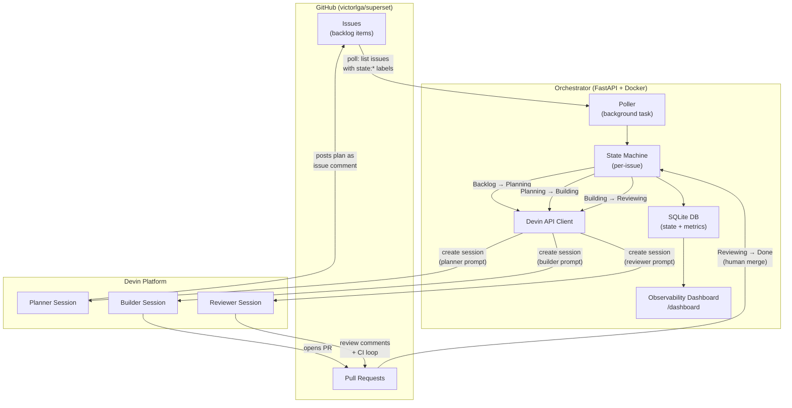

# Vulnerability Remediation Orchestrator

An event-driven system that uses the [Devin API](https://docs.devin.ai/api-reference/overview) to automatically plan, implement, review, and land fixes for security vulnerabilities in a fork of [Apache Superset](https://github.com/apache/superset).

---

## Table of Contents

- [Quick Start](#quick-start)
- [Configuration](#configuration)
- [How It Works](#how-it-works)
- [Architecture](#architecture)
- [Observability Dashboard](#observability-dashboard)
- [Project Structure](#project-structure)
- [Running Tests](#running-tests)
- [Simulating the Workflow](#simulating-the-workflow)
- [Tech Stack](#tech-stack)
- [Further Documentation](#further-documentation)

---

## Quick Start

### Prerequisites

- [Docker](https://docs.docker.com/get-docker/) and [Docker Compose](https://docs.docker.com/compose/install/) (v2+)
- A Devin API token from a [service user](https://app.devin.ai) (Team Settings > Service Users)
- A GitHub Personal Access Token with `repo` scope

### 1. Clone the repository

```bash
git clone https://github.com/victorlga/cognition-takehome.git
cd cognition-takehome
```

### 2. Configure environment variables

Copy the example file and fill in your credentials:

```bash
cp .env.example .env
# Edit .env with your actual values
```

### 3. Start the orchestrator

```bash
docker compose up --build
```

The orchestrator starts on **http://localhost:8000** with:

- Polling enabled (checks GitHub every 30 seconds)
- SQLite database at `./data/orchestrator.db`
- Dashboard at **http://localhost:8000/dashboard**
- Health check at **http://localhost:8000/health**
- Metrics API at **http://localhost:8000/api/metrics**

### 4. Seed sample data (optional)

To populate the dashboard with sample data for demonstration:

```bash
docker compose exec orchestrator python -m scripts.seed_sample_data
```

---

## Configuration

All configuration is via environment variables (or a `.env` file). See [`.env.example`](.env.example) for a ready-to-use template.

| Variable | Description | Default |
|---|---|---|
| `DEVIN_API_KEY` | Devin API token from a service user | *(required)* |
| `DEVIN_ORG_ID` | Devin organization ID | *(required)* |
| `GITHUB_TOKEN` | GitHub PAT with `repo` scope | *(required)* |
| `POLL_INTERVAL_SECONDS` | How often the poller checks GitHub (seconds) | `30` |
| `POLLING_ENABLED` | Enable/disable background polling | `true` |

> **Note:** Use [Devin service users](https://app.devin.ai) for API authentication, not the legacy API keys page.

---

## How It Works

The orchestrator watches a GitHub repository for issues labeled `remediation-target` and drives each one through a four-stage pipeline using Devin sessions as the core execution primitive:

```
Backlog ──► Planning ──► Building ──► Reviewing ──► Done
             (Devin)      (Devin)      (Devin)
```

1. **Planning** -- A Devin session analyzes the issue, researches the codebase, and posts a step-by-step remediation plan as an issue comment.
2. **Building** -- A Devin session implements the approved plan, writes tests, and opens a pull request.
3. **Reviewing** -- A Devin session reviews the PR for correctness, security, and style, iterating until CI is green.
4. **Done** -- The orchestrator records completion metrics after human merge.

### Trigger Mechanism

The orchestrator uses **polling** as its primary trigger. A background `asyncio` task polls the GitHub API every N seconds (default: 30) for open issues carrying `state:*` labels. When a label-derived state differs from the internal DB state, the state machine fires a transition and spawns the appropriate Devin session.

This design eliminates the need for a publicly reachable webhook endpoint -- `docker compose up` just works with zero tunnel or deploy setup.

---

## Architecture



For the full architecture document, see [`docs/ARCHITECTURE.md`](docs/ARCHITECTURE.md).

---

## Observability Dashboard

The dashboard at `/dashboard` answers the question: **"If I were an engineering leader, how would I know this is working?"**

### Key Metrics

- **Median Time-to-Remediation (TTR)** -- End-to-end time from planning to done, with p90 and per-stage breakdown
- **Issues Remediated** -- Total count and throughput over time
- **Session Success Rate** -- Percentage of Devin sessions completing without errors
- **Active Sessions** -- Currently running planner/builder/reviewer sessions

### Pipeline Health

- **Issues by Status** -- Funnel chart (backlog / planning / building / reviewing / done / error)
- **Error Rate** -- With recent error details and live status indicator

### Velocity & Efficiency

- **Open vs. Closed Vulnerability Trend** -- Cumulative issues filed vs. remediated
- **Throughput over Time** -- Issues remediated per day
- **Devin Compute Cost per Fix** -- Average session-minutes per remediated issue
- **Mean Time to First Response** -- Time from issue creation to first Devin session

### Recent Activity

- Live feed of the last 20 session events with links to PRs and issues

The dashboard auto-refreshes every 30 seconds via htmx. A JSON API is available at `/api/metrics` for programmatic access.

---

## Project Structure

```
cognition-takehome/
├── orchestrator/
│   ├── app/
│   │   ├── main.py            # FastAPI entry point + lifespan (poller startup)
│   │   ├── config.py          # Settings from environment variables
│   │   ├── poller.py          # Polling-based trigger (GitHub label detection)
│   │   ├── state_machine.py   # Issue state transitions + Devin session dispatch
│   │   ├── devin_client.py    # Async Devin API v3 wrapper
│   │   ├── github_client.py   # Async GitHub API helper
│   │   ├── prompts.py         # Planner / Builder / Reviewer prompt templates
│   │   ├── scanner.py         # Periodic vulnerability scanner (stub)
│   │   ├── db.py              # SQLite persistence + aggregate metrics
│   │   └── dashboard.py       # Dashboard routes + metrics API
│   ├── templates/
│   │   └── dashboard.html     # Jinja2 + htmx + Chart.js dashboard
│   ├── scripts/
│   │   └── seed_sample_data.py  # Populate DB with sample data for demo
│   ├── tests/                 # pytest suite (DB, state machine, poller, prompts, API client)
│   ├── Dockerfile
│   └── pyproject.toml
├── docs/                      # Planning, architecture, and phase docs
├── docker-compose.yml
├── .env.example               # Template for required environment variables
└── .gitignore
```

---

## Running Tests

From the `orchestrator/` directory:

```bash
# Install dev dependencies
pip install -e ".[dev]"

# Run the test suite
pytest

# Run with coverage
coverage run -m pytest && coverage report
```

The test suite covers:

- **Database layer** -- CRUD operations, metrics aggregation
- **State machine** -- Transition validation, Devin session dispatch, error handling
- **Poller** -- Label extraction, poll cycle logic, idempotency
- **Devin API client** -- Session creation, polling, message sending (mocked HTTP)
- **Prompt templates** -- Template rendering with correct context injection

---

## Simulating the Workflow

To see the full pipeline in action without waiting for real Devin sessions:

1. **Start the orchestrator** with `docker compose up --build`
2. **Create an issue** on `victorlga/superset` with the labels `remediation-target` and `state:planning`
3. **Watch the logs** -- the poller detects the label and triggers a planner Devin session
4. **Advance the pipeline** by changing the issue label from `state:planning` to `state:building`, then `state:reviewing`, then `state:done`
5. **Monitor progress** on the dashboard at http://localhost:8000/dashboard

Each label change triggers the corresponding Devin session type (planner, builder, reviewer) through the state machine.

---

## Tech Stack

| Component | Technology | Rationale |
|---|---|---|
| Orchestrator | Python 3.12 + FastAPI | Async-native, auto-docs, matches Superset's ecosystem |
| Persistence | SQLite via aiosqlite | Zero-ops, single-file, easy to inspect |
| Containerization | Docker Compose | Single `docker compose up` -- required by spec |
| Trigger | Polling (asyncio background task) | No webhook endpoint needed -- works out of the box |
| Devin API | v3 REST API | Session management, prompt injection, status polling |
| Dashboard | Jinja2 + htmx + Chart.js | No separate build step, served from the same process |

---

## Further Documentation

- [`docs/ARCHITECTURE.md`](docs/ARCHITECTURE.md) -- Full system design, schema, prompt templates, and design decisions
- [`docs/PLAN.md`](docs/PLAN.md) -- Master plan with phased implementation strategy
- [`docs/TAKEHOME.md`](docs/TAKEHOME.md) -- Original assignment brief
- [`docs/PHASE_1.md`](docs/PHASE_1.md) through [`docs/PHASE_6.md`](docs/PHASE_6.md) -- Per-phase implementation details

---

*Originally written and maintained by contributors and [Devin](https://app.devin.ai), with updates from the core team.*
