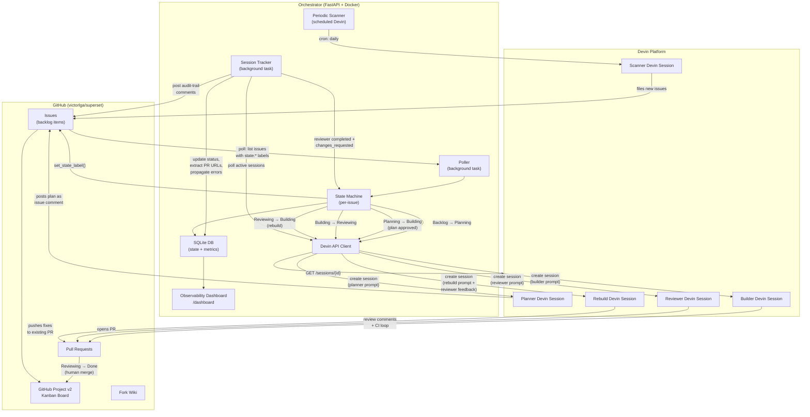

# Architecture — Event-Driven Vulnerability Remediation System

> **Status:** Approved (Phase 0 — Planning)
> **Last updated:** 2026-04-12

## Overview

An event-driven system that uses the **Devin API** as its core execution primitive to automatically plan, build, review, and land fixes for security vulnerabilities and high-impact bugs in [Apache Superset](https://github.com/apache/superset). The system is triggered by **issue label transitions** (`state:*` labels) and orchestrated by a lightweight FastAPI backend.

---

## System Diagram



---

## Tech Stack

| Component | Choice | Rationale |
|---|---|---|
| **Orchestrator** | Python 3.12 + FastAPI | Fastest path to a working async API client. Python is Superset's own language, so the reviewer audience is familiar. `httpx` for async HTTP calls. |
| **Persistence** | SQLite (via `aiosqlite`) | Zero-ops, single-file, sufficient for demo-scale state. Easily inspectable for the Loom walkthrough. |
| **Containerization** | Docker Compose | Single `docker compose up` to run the orchestrator and dashboard. Zero additional configuration needed beyond env vars. Required by the take-home spec. |
| **Polling** | Background `asyncio` task | Polls the GitHub API every N seconds for `state:*` label changes. Eliminates the need for a publicly-reachable webhook endpoint — `docker compose up` just works. |
| **Devin API** | v3 REST (`https://api.devin.ai/v3/organizations/{org_id}/`) | Latest API with RBAC, session attribution, playbook attachment, and structured polling. Endpoints include org_id in the URL path. |
| **Dashboard** | FastAPI + Jinja2 + htmx | Minimal single-page dashboard served by the same FastAPI process. No separate frontend build step. Answers "how would an engineering leader know this is working?" |
| **Scanning** | `pip-audit`, `bandit`, `semgrep`, `npm audit` | Industry-standard tools. Results feed into issue creation. |
| **GitHub CLI** | `gh` | Issue/project/PR management from Devin sessions and orchestrator scripts. |

---

## Session Lifecycle

When the pipeline advances (e.g. `planning → building`), the state machine **finalizes the previous session** by marking its `session_log` entry as `completed`. This is the primary mechanism that keeps the dashboard accurate.

As a safety net, the **session tracker** also checks whether an active session has been superseded: if the Devin API reports a session as `running` but the issue has already advanced past that session's stage, the tracker overrides the status to `completed`.

---

## Event Flow — Detailed

### Primary Trigger: Polling-Based Label Detection

> **Design choice:** The orchestrator uses **polling** as the primary trigger instead of webhooks. This eliminates the need for a publicly-reachable URL, so `docker compose up` works out of the box with zero tunnel or deploy setup.

A background `asyncio` task polls the GitHub API every N seconds (default: 30) for open issues carrying the `remediation-target` label and any `state:*` label. For each issue, the poller extracts the state from the label name, compares it against the SQLite DB state, and fires a transition when they differ.

| Label Detected | Transition | Devin Session Type |
|---|---|---|
| `state:planning` | Backlog → Planning | **Planner**: reads the issue, researches the codebase, posts a remediation plan as an issue comment |
| `state:building` | Planning → Building | **Builder**: executes the approved plan, writes code, opens a PR |
| `state:reviewing` | Building → Reviewing | **Reviewer**: reviews the PR, runs tests, iterates with builder until CI is green |
| `state:done` | Reviewing → Done | Log completion — orchestrator records metrics |
| *(auto)* | Reviewing → Building | **Rebuild**: triggered automatically when a reviewer requests changes. The session tracker detects `CHANGES_REQUESTED` on the PR, collects the reviewer's feedback, and spawns a new builder session to address the findings. Capped at `max_rebuild_attempts` (default: 3). |

**Polling flow:**
1. `GET /repos/{repo}/issues?labels=remediation-target&state=open` (paginated)
2. For each issue, extract `state:*` label → derive internal status
3. Compare against `issue_state.status` in SQLite
4. If different → delegate to `handle_status_change()` in the state machine
5. If same → skip (idempotent, no duplicate transitions)

Duplicate triggers are no-ops because the poller always checks the DB state before firing. The state machine itself also validates transitions (no skipping states).

### Secondary Trigger: Periodic Vulnerability Scan

A **Scheduled Devin session** (or orchestrator cron job) runs daily:
1. Clones `victorlga/superset` (latest main)
2. Runs `pip-audit`, `bandit`, `semgrep`, `npm audit`
3. Diffs findings against previously filed issues (dedup by CVE/rule ID)
4. Files new GitHub issues for net-new findings, adds them to the Project board's Backlog

This makes the "event-driven" narrative richer: the system both reacts to human-curated issues AND proactively discovers new ones.

---

## Orchestrator State Machine

Each tracked issue has a state record in SQLite:

```sql
CREATE TABLE issue_state (
    issue_id        INTEGER PRIMARY KEY,  -- GitHub issue number
    issue_node_id   TEXT NOT NULL,
    title           TEXT,
    category        TEXT NOT NULL DEFAULT 'security',  -- security|high-impact-bug|dependency|sast
    status          TEXT NOT NULL DEFAULT 'backlog',  -- backlog|planning|building|reviewing|done|error
    planner_session TEXT,       -- Devin session ID
    builder_session TEXT,
    reviewer_session TEXT,
    plan_text       TEXT,       -- cached remediation plan
    pr_url          TEXT,
    created_at      TEXT NOT NULL,
    updated_at      TEXT NOT NULL,
    planning_started_at TEXT,   -- timestamp when moved to planning
    building_started_at TEXT,   -- timestamp when moved to building
    reviewing_started_at TEXT,  -- timestamp when moved to reviewing
    done_at             TEXT,   -- timestamp when moved to done
    rebuild_count       INTEGER NOT NULL DEFAULT 0,  -- number of rebuild attempts
    error_message   TEXT
);

CREATE TABLE session_log (
    id              INTEGER PRIMARY KEY AUTOINCREMENT,
    issue_id        INTEGER NOT NULL,
    session_id      TEXT NOT NULL,
    session_type    TEXT NOT NULL,  -- planner|builder|reviewer|scanner
    status          TEXT NOT NULL,  -- running|completed|failed
    started_at      TEXT NOT NULL,
    finished_at     TEXT,
    duration_seconds INTEGER,
    FOREIGN KEY (issue_id) REFERENCES issue_state(issue_id)
);
```

---

## Devin Session Prompts (Templates)

Each session type gets a structured prompt built by the orchestrator:

### Planner Prompt (template)
```
You are a security engineer. Analyze the following GitHub issue and produce a remediation plan.

Issue: {issue_url}
Title: {issue_title}
Body: {issue_body}

Repository: victorlga/superset (fork of apache/superset)

Instructions:
1. Read the issue carefully. Identify the root cause.
2. Search the codebase for affected files.
3. Write a step-by-step remediation plan (max 10 steps).
4. For each step, specify: file path, what changes, why.
5. Identify test files that need updating or new tests to write.
6. Post the plan as a comment on the issue.

Output: A structured remediation plan posted as an issue comment.
```

### Builder Prompt (template)
```
You are a senior engineer. Implement the approved remediation plan for this issue.

Issue: {issue_url}
Approved Plan: {plan_text}

Repository: victorlga/superset
Branch: fix/{issue_number}-{slug}

Instructions:
1. Create a feature branch from main.
2. Implement each step of the plan.
3. Write or update tests to cover the fix.
4. Run the relevant test suite to verify.
5. Open a PR against main with a clear description.

Output: A PR URL posted as an issue comment.
```

### Reviewer Prompt (template)
```
You are a code reviewer specializing in security. Review this PR.

PR: {pr_url}
Related Issue: {issue_url}

Instructions:
1. Review the diff for correctness, security, and style.
2. Run the test suite. If tests fail, leave review comments.
3. If changes are needed, leave specific inline comments.
4. If the PR is ready, approve it.

Output: Review comments on the PR. Final status: approved or changes_requested.
```

### Rebuild Prompt (template)
```
You are a senior engineer. A code reviewer found problems with a PR. Fix them.

PR: {pr_url}
Related Issue: {issue_url}
Rebuild attempt: {rebuild_count}

Reviewer Feedback:
{review_feedback}

Instructions:
1. Check out the existing PR branch — do NOT create a new branch.
2. Read the reviewer's feedback carefully.
3. Address every issue raised by the reviewer.
4. Run the relevant test suite to verify your fixes.
5. Push your changes to the same PR branch.

Output: Updated commits pushed to the existing PR branch.
```

---

## Observability

The dashboard (served at `/dashboard` by the FastAPI app) answers the VP-of-Engineering question: **"How do I know this is working?"**

### Metrics — What a VP of Engineering Wants to See

Focused on three questions:

**Task Status ("What is active and what is done?")**
- **Issues Remediated** — count of issues at `done` vs. total. The headline throughput metric.
- **Active Devin Sessions** — count of running planner/builder/reviewer sessions, broken down by type. Answers: "How busy is the system?"
- **Pipeline Status** — horizontal bar chart: backlog / planning / building / reviewing / done / error. Answers: "Where are things stuck?"

**Success / Failure ("Is the system reliable?")**
- **Session Success Rate** — % of Devin sessions that complete without error (completed / total).
- **Failed Sessions** — count of sessions that ended in `failed` status.

**Recent Activity ("What just happened?")**
- **Activity Feed** — latest 20 session events: session type, issue, status, duration, with links to PRs and issues. A VP can glance at this and understand the current state without digging.

### Implementation
- Metrics computed from SQLite on each dashboard load (demo-scale, no need for a metrics pipeline)
- Rendered via Jinja2 templates with Chart.js for visualizations
- Auto-refreshes via htmx polling every 30 seconds
- JSON API at `/api/metrics` for programmatic access
- JSON API at `/api/issues` for listing all tracked issues
- Dashboard layout: 3 summary cards at top (issues remediated, active sessions, success rate), pipeline status chart, activity feed at bottom

---

## Secrets

All secrets are provided via environment variables. **Never hardcode.**

| Variable | Purpose | How to Provision | Where Used |
|---|---|---|---|
| `DEVIN_API_KEY` | Devin API v3 token (from a **service user**, not the legacy API keys page) | [app.devin.ai](https://app.devin.ai) → Team Settings → Service Users → create a service user with Admin access → copy its API token | Orchestrator → Devin API |
| `DEVIN_ORG_ID` | Devin organization ID | Shown on the service user page or in any Devin API response | Orchestrator → Devin API |
| `GITHUB_TOKEN` | GitHub PAT with `repo`, `project`, `admin:org` scopes | GitHub → Settings → Developer Settings → PAT (fine-grained) | Orchestrator → GitHub API, `gh` CLI |
| `POLL_INTERVAL_SECONDS` | Polling interval in seconds (default: 30) | Set in `.env` or `docker-compose.yml` | Poller background task |
| `POLLING_ENABLED` | Enable/disable the background poller (default: true) | Set in `.env` or `docker-compose.yml` | Poller background task |
| `MAX_REBUILD_ATTEMPTS` | Maximum rebuild attempts before giving up (default: 3) | Set in `.env` or `docker-compose.yml` | State machine rebuild logic |

---

## Directory Structure (Target)

```
cognition-takehome/
├── docs/
│   ├── image.png
│   └── ARCHITECTURE.md
├── orchestrator/
│   ├── Dockerfile
│   ├── pyproject.toml
│   ├── app/
│   │   ├── main.py             # FastAPI app entry
│   │   ├── config.py           # Settings / env vars
│   │   ├── poller.py           # Polling-based state machine driver (primary trigger)
│   │   ├── session_tracker.py  # Background loop: polls active Devin sessions to completion
│   │   ├── devin_client.py     # Devin API v3 wrapper
│   │   ├── github_client.py    # GitHub API helper
│   │   ├── state_machine.py    # Issue state transitions
│   │   ├── prompts.py          # Devin session prompt templates
│   │   ├── db.py               # SQLite models + queries
│   │   └── dashboard.py        # Dashboard routes + metrics
│   └── templates/
│       └── dashboard.html      # Jinja2 + htmx dashboard
├── docker-compose.yml
├── CHANGELOG.md
├── README.md
└── .gitignore
```

---

## Design Decisions Log

| # | Decision | Alternatives Considered | Rationale |
|---|---|---|---|
| 1 | **FastAPI** over Node/Express | Express, Hono | Python matches Superset's ecosystem; FastAPI has native async, auto-docs, Pydantic validation. Faster to ship for a solo dev in 2-3 hours. |
| 2 | **SQLite** over Postgres | Postgres, Redis | Zero-ops. Demo-scale data (< 100 rows). Single file = easy to inspect in Loom. No Docker service dependency. |
| 3 | **Polling** as primary trigger | GitHub webhooks, GitHub Projects v2 webhooks | Polling eliminates the need for a publicly-reachable URL. `docker compose up` just works — zero tunnel, zero deploy, zero webhook config. The poller checks `state:*` labels on issues via the GitHub API every N seconds. |
| 4 | **Issue labels** as state encoding | GitHub Projects v2 status field | Labels are the source of truth for pipeline state. The Projects v2 board is still used for visual kanban tracking but does not drive the state machine. Labels are readable via polling. |
| 5 | **Devin-as-primitive** for planner/builder/reviewer | Custom LLM calls, hand-written scripts | The take-home explicitly evaluates "leveraging Devin as a core primitive." Each role is a Devin session with a tailored prompt. |
| 6 | **htmx dashboard** over React SPA | React, Streamlit, Grafana | Zero build step. Serves from the same FastAPI process. htmx gives reactivity without JS complexity. |
| 7 | **Scheduled Devin** for periodic scans | Cron in orchestrator | Demonstrates another Devin API capability (scheduled sessions). Enriches the event-driven narrative. |
| 8 | **Docker Compose** for deployment | Kubernetes, bare metal | Required by take-home spec. Simple, portable, reproducible. |
| 9 | **Bidirectional GitHub sync** for label + comment feedback | Fire-and-forget, manual label management | `set_state_label()` in the state machine and `post_issue_comment()` in the session tracker close the feedback loop. The issue thread becomes the audit trail. Label sync makes the system self-driving — no human needs to manually update labels after the initial trigger. |
| 10 | **Auto-rebuild** on reviewer changes_requested | Manual re-trigger, single-pass pipeline | When the reviewer Devin session requests changes, the session tracker automatically detects `CHANGES_REQUESTED` on the PR, collects reviewer feedback (review bodies + inline comments), and triggers a `reviewing → building` transition. The rebuild session receives the reviewer's specific feedback in its prompt. Capped at `max_rebuild_attempts` (default: 3) to prevent infinite loops. |
