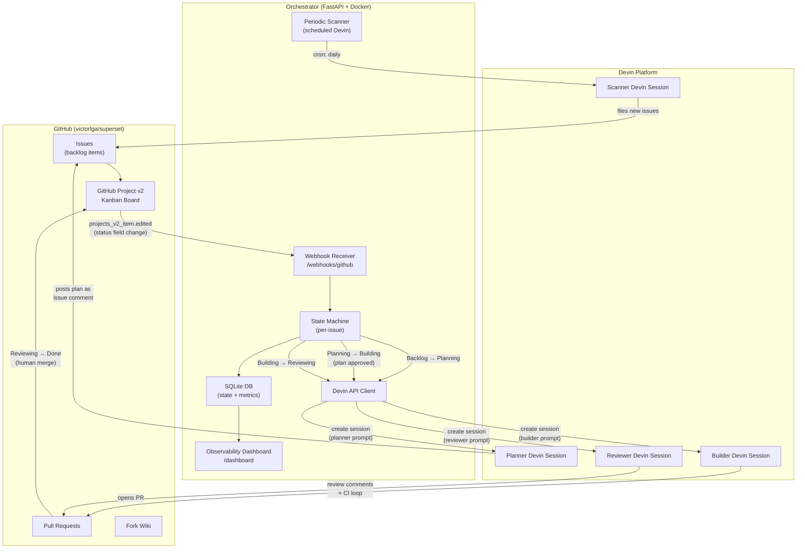

# Architecture — Event-Driven Vulnerability Remediation System

> **Status:** Approved (Phase 0 — Planning)
> **Last updated:** 2026-04-12

## Overview

An event-driven system that uses the **Devin API** as its core execution primitive to automatically plan, build, review, and land fixes for security vulnerabilities and high-impact bugs in [Apache Superset](https://github.com/apache/superset). The system is triggered by GitHub Project board movements and orchestrated by a lightweight FastAPI backend.

---

## System Diagram



---

## Tech Stack

| Component | Choice | Rationale |
|---|---|---|
| **Orchestrator** | Python 3.12 + FastAPI | Fastest path to a working webhook receiver + API client. Python is Superset's own language, so the reviewer audience is familiar. `httpx` for async Devin API calls. |
| **Persistence** | SQLite (via `aiosqlite`) | Zero-ops, single-file, sufficient for demo-scale state. Easily inspectable for the Loom walkthrough. |
| **Containerization** | Docker Compose | Single `docker compose up` to run the orchestrator, expose the webhook endpoint, and (optionally) the dashboard. Required by the take-home spec. |
| **Webhook Tunnel** | [localhost.run](https://localhost.run) (dev) | GitHub webhooks need a public URL. Zero-signup SSH tunnel: `ssh -R 80:localhost:8000 nokey@localhost.run`. No account or token required. |
| **Devin API** | v3 REST (`https://api.devin.ai/v3/`) | Latest API with RBAC, session attribution, playbook attachment, and structured polling. |
| **Dashboard** | FastAPI + Jinja2 + htmx | Minimal single-page dashboard served by the same FastAPI process. No separate frontend build step. Answers "how would an engineering leader know this is working?" |
| **Scanning** | `pip-audit`, `bandit`, `semgrep`, `npm audit` | Industry-standard tools. Results feed into issue creation. |
| **GitHub CLI** | `gh` | Issue/project/PR management from Devin sessions and orchestrator scripts. |

---

## Event Flow — Detailed

### Primary Trigger: GitHub Projects v2 Webhooks

GitHub Projects v2 fire `projects_v2_item` webhook events when item fields change. The **Status** field (which maps to kanban columns) triggers an `edited` action with `changes.field_value`. The orchestrator maps status transitions to Devin session types:

| Status Transition | Orchestrator Action | Devin Session Type |
|---|---|---|
| `Backlog → Planning` | Spawn planner | **Planner**: reads the issue, researches the codebase, posts a remediation plan as an issue comment |
| `Planning → Building` | Spawn builder(s) | **Builder**: executes the approved plan, writes code, opens a PR |
| `Building → Reviewing` | Spawn reviewer | **Reviewer**: reviews the PR, runs tests, iterates with builder until CI is green |
| `Reviewing → Done` | Log completion | Human merges the PR; orchestrator records metrics |

**Webhook payload structure** (abbreviated):
```json
{
  "action": "edited",
  "changes": {
    "field_value": {
      "field_node_id": "PVTSSF_...",
      "field_type": "single_select"
    }
  },
  "projects_v2_item": {
    "id": 12345,
    "node_id": "PVTI_...",
    "content_node_id": "I_...",
    "content_type": "Issue"
  }
}
```

The orchestrator resolves `content_node_id` to the linked issue via the GitHub GraphQL API, then reads the issue body + comments to build the Devin session prompt.

### Webhook Setup

The orchestrator registers a webhook on `victorlga/superset` subscribing to `projects_v2_item` events. The webhook secret is verified via HMAC-SHA256 on every request.

### Fallback: Issue Labels

If GitHub Projects v2 webhooks prove unreliable in practice (e.g., event delivery gaps, missing field metadata), the system falls back to **issue label transitions** as the state machine driver:

| Label Applied | Equivalent Transition |
|---|---|
| `state:planning` | Backlog → Planning |
| `state:building` | Planning → Building |
| `state:reviewing` | Building → Reviewing |
| `state:done` | Reviewing → Done |

The orchestrator would then subscribe to `issues` webhook events filtered by label changes. This fallback is documented but the primary path uses Projects v2.

### Secondary Trigger: Periodic Vulnerability Scan

A **Scheduled Devin session** (or orchestrator cron job) runs daily:
1. Clones `victorlga/superset` (latest main)
2. Runs `pip-audit`, `bandit`, `semgrep`, `npm audit`
3. Diffs findings against previously filed issues (dedup by CVE/rule ID)
4. Files new GitHub issues for net-new findings, adds them to the Project board's Backlog

This makes the "event-driven" narrative richer: the system both reacts to human-curated issues AND proactively discovers new ones.

---

## Orchestrator State Machine

Each tracked issue has a state record in SQLite:

```sql
CREATE TABLE issue_state (
    issue_id        INTEGER PRIMARY KEY,  -- GitHub issue number
    issue_node_id   TEXT NOT NULL,
    project_item_id INTEGER,
    title           TEXT,
    category        TEXT NOT NULL DEFAULT 'security',  -- security|high-impact-bug|dependency|sast
    status          TEXT NOT NULL DEFAULT 'backlog',  -- backlog|planning|building|reviewing|done|error
    planner_session TEXT,       -- Devin session ID
    builder_session TEXT,
    reviewer_session TEXT,
    plan_text       TEXT,       -- cached remediation plan
    pr_url          TEXT,
    created_at      TEXT NOT NULL,
    updated_at      TEXT NOT NULL,
    planning_started_at TEXT,   -- timestamp when moved to planning
    building_started_at TEXT,   -- timestamp when moved to building
    reviewing_started_at TEXT,  -- timestamp when moved to reviewing
    done_at         TEXT,       -- timestamp when moved to done
    error_message   TEXT
);

CREATE TABLE session_log (
    id              INTEGER PRIMARY KEY AUTOINCREMENT,
    issue_id        INTEGER NOT NULL,
    session_id      TEXT NOT NULL,
    session_type    TEXT NOT NULL,  -- planner|builder|reviewer|scanner
    status          TEXT NOT NULL,  -- running|completed|error
    started_at      TEXT NOT NULL,
    finished_at     TEXT,
    duration_seconds INTEGER,
    FOREIGN KEY (issue_id) REFERENCES issue_state(issue_id)
);
```

---

## Devin Session Prompts (Templates)

Each session type gets a structured prompt built by the orchestrator:

### Planner Prompt (template)
```
You are a security engineer. Analyze the following GitHub issue and produce a remediation plan.

Issue: {issue_url}
Title: {issue_title}
Body: {issue_body}

Repository: victorlga/superset (fork of apache/superset)

Instructions:
1. Read the issue carefully. Identify the root cause.
2. Search the codebase for affected files.
3. Write a step-by-step remediation plan (max 10 steps).
4. For each step, specify: file path, what changes, why.
5. Identify test files that need updating or new tests to write.
6. Post the plan as a comment on the issue.

Output: A structured remediation plan posted as an issue comment.
```

### Builder Prompt (template)
```
You are a senior engineer. Implement the approved remediation plan for this issue.

Issue: {issue_url}
Approved Plan: {plan_text}

Repository: victorlga/superset
Branch: fix/{issue_number}-{slug}

Instructions:
1. Create a feature branch from main.
2. Implement each step of the plan.
3. Write or update tests to cover the fix.
4. Run the relevant test suite to verify.
5. Open a PR against main with a clear description.

Output: A PR URL posted as an issue comment.
```

### Reviewer Prompt (template)
```
You are a code reviewer specializing in security. Review this PR.

PR: {pr_url}
Related Issue: {issue_url}

Instructions:
1. Review the diff for correctness, security, and style.
2. Run the test suite. If tests fail, leave review comments.
3. If changes are needed, leave specific inline comments.
4. If the PR is ready, approve it.

Output: Review comments on the PR. Final status: approved or changes_requested.
```

---

## Observability

The dashboard (served at `/dashboard` by the FastAPI app) answers the VP-of-Engineering question: **"How do I know this is working?"**

### Metrics — What a VP of Engineering Wants to See

**Pipeline Health ("Is the system working right now?")**
- **Active Devin Sessions** — count of running planner/builder/reviewer sessions, broken down by type. Answers: "How busy is the system?"
- **Issues by Status** — bar chart: backlog / planning / building / reviewing / done / error. Answers: "Where are things stuck?" A pile-up in any column signals a bottleneck.
- **Error Rate** — % of sessions that ended in error, with most recent error messages. Answers: "Is something broken?"

**Velocity & Efficiency ("Is this worth the investment?")**
- **Time-to-Remediation (TTR)** — median and p90 time from issue entering Planning to PR merged. The headline metric. Broken down by stage (planning time, build time, review time) to show where time is spent.
- **Throughput** — issues remediated per day/week. Trend line shows whether the system is accelerating.
- **Session Success Rate** — % of Devin sessions that complete without error. Track over time to show reliability improving.
- **Devin Compute Cost per Fix** — total session-minutes / issues completed. Proxy for cost-efficiency. (Computed from `session_log.duration_seconds`.)

**Risk Posture ("Are we safer than yesterday?")**
- **Open vs. Closed Vulnerability Trend** — line chart showing cumulative issues filed vs. issues remediated over time. The gap should be shrinking.
- **Severity Breakdown** — issues by category (security / high-impact bug / dependency / SAST). Shows the system handles diverse risk types, not just version bumps.
- **Mean Time to First Response (MTFR)** — time from issue creation to first planner session starting. Measures how quickly the system reacts.

**Recent Activity ("What just happened?")**
- **Activity Feed** — latest 20 session events: session type, issue, status, duration, with links to PRs and issues. A VP can glance at this and understand the current state without digging.

### Implementation
- Metrics computed from SQLite on each dashboard load (demo-scale, no need for a metrics pipeline)
- Rendered via Jinja2 templates with Chart.js for visualizations
- Auto-refreshes via htmx polling every 30 seconds
- JSON API at `/api/metrics` for programmatic access
- Dashboard layout: 4 summary cards at top (TTR, throughput, success rate, active sessions), two chart rows (pipeline funnel + trend lines), activity feed at bottom

---

## Secrets

All secrets are provided via environment variables. **Never hardcode.**

| Variable | Purpose | How to Provision | Where Used |
|---|---|---|---|
| `DEVIN_API_KEY` | Devin API v3 token (from a **service user**, not the legacy API keys page) | [app.devin.ai](https://app.devin.ai) → Team Settings → Service Users → create a service user with Admin access → copy its API token | Orchestrator → Devin API |
| `DEVIN_ORG_ID` | Devin organization ID | Shown on the service user page or in any Devin API response | Orchestrator → Devin API |
| `GITHUB_TOKEN` | GitHub PAT with `repo`, `project`, `admin:org` scopes | GitHub → Settings → Developer Settings → PAT (fine-grained) | Orchestrator → GitHub API, `gh` CLI |
| `GITHUB_WEBHOOK_SECRET` | HMAC secret for webhook signature verification | Self-generated: `openssl rand -hex 20` | Orchestrator webhook endpoint |
| *(tunnel)* | localhost.run — no token needed | `ssh -R 80:localhost:8000 nokey@localhost.run` | Local development |

> **Note:** The legacy "API Keys" page on Devin is deprecated. Use **Service Users** instead. A service user named `takehome` with Admin access has already been created for this project.

---

## Directory Structure (Target)

```
cognition-takehome/
├── docs/
│   ├── TAKEHOME.md
│   ├── PLAN.md
│   ├── ARCHITECTURE.md
│   ├── PHASE_1.md
│   ├── PHASE_2.md
│   ├── PHASE_3.md
│   ├── PHASE_4.md
│   ├── PHASE_5.md
│   └── PHASE_6.md
├── orchestrator/
│   ├── Dockerfile
│   ├── pyproject.toml
│   ├── app/
│   │   ├── main.py          # FastAPI app entry
│   │   ├── config.py        # Settings / env vars
│   │   ├── webhook.py       # GitHub webhook handler
│   │   ├── devin_client.py  # Devin API v3 wrapper
│   │   ├── github_client.py # GitHub API helper
│   │   ├── state_machine.py # Issue state transitions
│   │   ├── prompts.py       # Devin session prompt templates
│   │   ├── scanner.py       # Periodic vuln scan logic
│   │   ├── db.py            # SQLite models + queries
│   │   └── dashboard.py     # Dashboard routes + metrics
│   └── templates/
│       └── dashboard.html   # Jinja2 + htmx dashboard
├── docker-compose.yml
├── CHANGELOG.md
├── README.md
└── .gitignore
```

---

## Design Decisions Log

| # | Decision | Alternatives Considered | Rationale |
|---|---|---|---|
| 1 | **FastAPI** over Node/Express | Express, Hono | Python matches Superset's ecosystem; FastAPI has native async, auto-docs, Pydantic validation. Faster to ship for a solo dev in 2-3 hours. |
| 2 | **SQLite** over Postgres | Postgres, Redis | Zero-ops. Demo-scale data (< 100 rows). Single file = easy to inspect in Loom. No Docker service dependency. |
| 3 | **GitHub Projects v2 webhooks** as primary trigger | Issue labels, manual API polling | True event-driven architecture. Real kanban UX. Webhook payload includes field changes for status transitions. |
| 4 | **Issue labels as fallback** | Drop fallback | Safety net if Projects v2 webhook delivery is flaky. Minimal extra code. |
| 5 | **Devin-as-primitive** for planner/builder/reviewer | Custom LLM calls, hand-written scripts | The take-home explicitly evaluates "leveraging Devin as a core primitive." Each role is a Devin session with a tailored prompt. |
| 6 | **htmx dashboard** over React SPA | React, Streamlit, Grafana | Zero build step. Serves from the same FastAPI process. htmx gives reactivity without JS complexity. |
| 7 | **Scheduled Devin** for periodic scans | Cron in orchestrator | Demonstrates another Devin API capability (scheduled sessions). Enriches the event-driven narrative. |
| 8 | **Docker Compose** for deployment | Kubernetes, bare metal | Required by take-home spec. Simple, portable, reproducible. |
