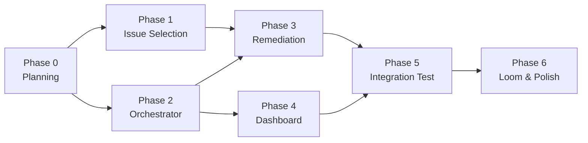

# Master Plan — Event-Driven Vulnerability Remediation System

> **Read this first.** This is the index for every Devin session working on this project.
> For the full assignment, see [`TAKEHOME.md`](./TAKEHOME.md).
> For architecture details, see [`ARCHITECTURE.md`](./ARCHITECTURE.md).
> For a log of what each phase actually did, see [`../CHANGELOG.md`](../CHANGELOG.md).

---

## Project Summary

Build an **event-driven vulnerability remediation system** that uses the **Devin API** to automatically plan, fix, review, and land security/bug fixes on a fork of [Apache Superset](https://github.com/apache/superset). Triggered by GitHub Project board movements, orchestrated by a FastAPI backend, observable via a lightweight dashboard.

**Deliverables** (from `TAKEHOME.md`):
1. Working Dockerized system
2. 5-minute Loom video
3. Solution repo (`victorlga/cognition-takehome`) with README
4. Fork (`victorlga/superset`) with remediated issues

**Audience:** VP of Engineering + senior ICs at Cognition.

---

## Phase Overview

| Phase | Name | Depends On | Parallelizable? | Estimated Devin Time | Key Output |
|-------|------|------------|-----------------|---------------------|------------|
| 0 | Planning & Scaffolding | — | N/A (this session) | 1 session | Docs, playbook, machine, wikis |
| 1 | Issue Selection & Seeding | Phase 0 | No | 1 session | 3–5 issues on fork, kanban board |
| 2 | Orchestrator Backend | Phase 0 | Yes (parallel w/ Phase 1) | 1–2 sessions | Working FastAPI app in Docker |
| 3 | Issue Remediation | Phase 1 + Phase 2 | Yes (sub-phases per issue) | 3–5 sessions | PRs with fixes on fork |
| 4 | Observability Dashboard | Phase 2 | No | 1 session | Dashboard at `/dashboard` |
| 5 | Integration Test & Demo Prep | Phase 3 + Phase 4 | No | 1 session | End-to-end verification |
| 6 | Loom Video & Final Polish | Phase 5 | No | Manual (Victor) | 5-min Loom, polished README |

---

## Phase Details

### Phase 0 — Planning & Scaffolding *(this session)*

**Goal:** Produce all planning docs, the Devin Playbook, the Devin Machine config, and GitHub wikis. No product code.

**Deliverables:**
- `docs/TAKEHOME.md` (already committed)
- `docs/PLAN.md` (this file)
- `docs/ARCHITECTURE.md`
- `docs/PHASE_1.md` through `docs/PHASE_6.md`
- `CHANGELOG.md` (initialized with contract)
- Devin Playbook: `cognition-takehome-prompting-playbook`
- Devin Machine configured for both repos
- GitHub wikis on both repos

**Definition of Done:** PR merged to `cognition-takehome/main`. All docs committed. Playbook and machine verified. Wikis populated.

---

### Phase 1 — Issue Selection & Seeding

**Goal:** Select 3–5 high-quality issues from apache/superset and seed them onto the fork.

**Depends on:** Phase 0 complete.

**Key constraints:**
- At least one real code-level security fix (XSS, auth, injection, etc.)
- At least one substantive bug with security/reliability impact
- At most one dependency/SAST finding
- Every pick must be non-trivial (no one-line version bumps)
- Difficulty bar: each fix should require reading code, understanding context, writing/modifying logic, and producing a test

**Deliverables:**
- Selection table with justification for each pick (and rejected candidates)
- Issues created on `victorlga/superset`
- GitHub Project board with issues in Backlog
- Webhook configured on the fork

**Definition of Done:** Issues exist on fork, project board visible, selection rationale documented in CHANGELOG.

See [`PHASE_1.md`](./PHASE_1.md) for the full prompt.

---

### Phase 2 — Orchestrator Backend

**Goal:** Build the FastAPI orchestrator that receives webhooks, manages state, and spawns Devin sessions.

**Depends on:** Phase 0 complete. Can run in parallel with Phase 1.

**Deliverables:**
- `orchestrator/` directory with all source code
- `Dockerfile` and `docker-compose.yml`
- Webhook endpoint (`POST /webhooks/github`)
- Devin API client (create session, poll status, send message)
- State machine (SQLite-backed)
- Prompt templates for planner/builder/reviewer
- Health check endpoint (`GET /health`)
- API endpoint for metrics (`GET /api/metrics`)

**Definition of Done:** `docker compose up` starts the orchestrator. Webhook endpoint accepts and verifies GitHub payloads. Devin sessions can be created via the API client. State transitions logged to SQLite.

See [`PHASE_2.md`](./PHASE_2.md) for the full prompt.

---

### Phase 3 — Issue Remediation *(orchestrator phase — spawns sub-phases)*

**Goal:** Drive each seeded issue through the full kanban pipeline using the orchestrator + Devin sessions.

**Depends on:** Phase 1 + Phase 2 complete.

**Structure:** This is an **orchestrator phase**. It spawns `PHASE_3_N.md` sub-prompts — one per issue — that can run in parallel since each issue is an independent fix on its own branch. The orchestrator phase itself handles:
1. Moving each issue from Backlog → Planning on the project board
2. Verifying the planner Devin session posts a plan
3. Moving Planning → Building (plan approval)
4. Verifying the builder Devin session opens a PR
5. Moving Building → Reviewing
6. Verifying the reviewer Devin session approves
7. Moving Reviewing → Done after human merge

**Deliverables:**
- One merged PR per issue on `victorlga/superset`
- Issue comments showing the planner → builder → reviewer flow
- CHANGELOG entry summarizing all remediations

**Definition of Done:** All selected issues have merged PRs with passing tests. The project board shows all items in Done.

See [`PHASE_3.md`](./PHASE_3.md) for the full prompt.

---

### Phase 4 — Observability Dashboard

**Goal:** Build the lightweight dashboard that answers "how would an engineering leader know this is working?"

**Depends on:** Phase 2 complete (needs the SQLite schema and FastAPI app).

**Deliverables:**
- Dashboard page at `/dashboard`
- Metrics: active sessions, issues by status, time-to-remediation, success rate, throughput
- Auto-refresh via htmx
- JSON API at `/api/metrics`

**Definition of Done:** Dashboard renders with real data from the SQLite database. Screenshots captured for the Loom.

See [`PHASE_4.md`](./PHASE_4.md) for the full prompt.

---

### Phase 5 — Integration Test & Demo Prep

**Goal:** End-to-end verification of the full pipeline. Prepare demo artifacts.

**Depends on:** Phase 3 + Phase 4 complete.

**Deliverables:**
- End-to-end test script that moves an issue through the full pipeline
- README.md updated with setup instructions, architecture diagram, and demo walkthrough
- Docker Compose verified on a clean machine
- Screenshots of dashboard, project board, and PRs for the Loom

**Definition of Done:** A fresh `docker compose up` + webhook delivery triggers the full pipeline. README is clear enough for a reviewer to reproduce.

See [`PHASE_5.md`](./PHASE_5.md) for the full prompt.

---

### Phase 6 — Loom Video & Final Polish

**Goal:** Record the 5-minute Loom and submit.

**Depends on:** Phase 5 complete. This is primarily a manual phase for Victor.

**Structure:**
- **What** (60s): Problem framing — vulnerability remediation at scale
- **How** (150s): System walkthrough — architecture, orchestrator, kanban flow, dashboard
- **Why** (60s): Why Devin is uniquely qualified — sessions as primitives, parallelism, review loop
- **When** (30s): Next steps — more repos, SAST integration, production hardening

**Deliverables:**
- 5-minute Loom video
- Submission via Ashby link

See [`PHASE_6.md`](./PHASE_6.md) for the full prompt.

---

## Cross-Cutting Concerns

### CHANGELOG Discipline
Every phase reads `CHANGELOG.md` before starting. Every phase appends a structured entry on completion. Sub-phases do NOT write to CHANGELOG directly — only the parent orchestrator phase does.

### Playbook
Every phase prompt begins with: `Before starting, load the Devin Playbook 'cognition-takehome-prompting-playbook' and follow it throughout this session.`

### Branch Strategy
- `main` on `cognition-takehome` — planning docs, orchestrator code, dashboard
- `main` on `victorlga/superset` — remediation PRs target this branch
- Feature branches: `fix/{issue_number}-{slug}` for remediation, `feat/{feature}` for orchestrator

### Time Budget
Victor has ~2–3 hours of active time. Devin compute is the leverage. Phases are designed to run with minimal babysitting. The critical path is: P0 → P1 → P3 → P5 → P6, with P2 and P4 parallelizable.
